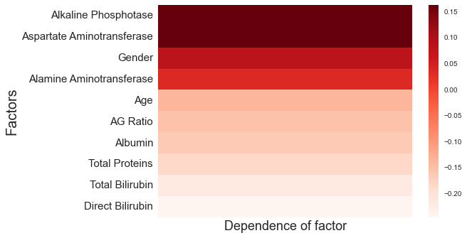
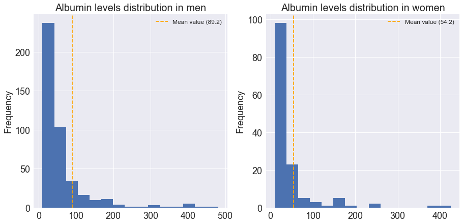
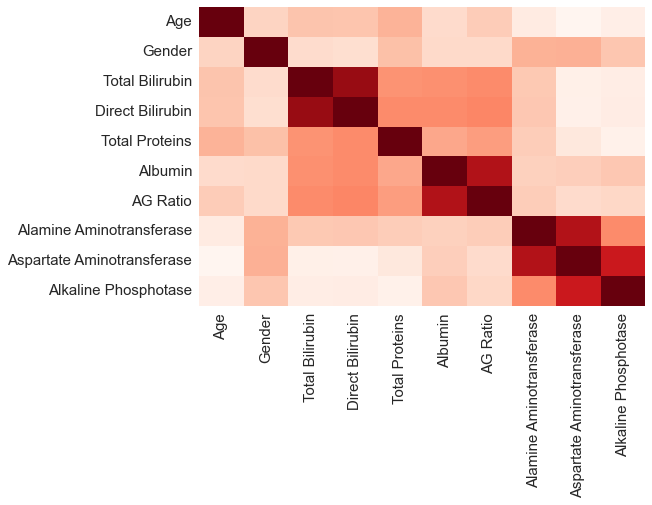
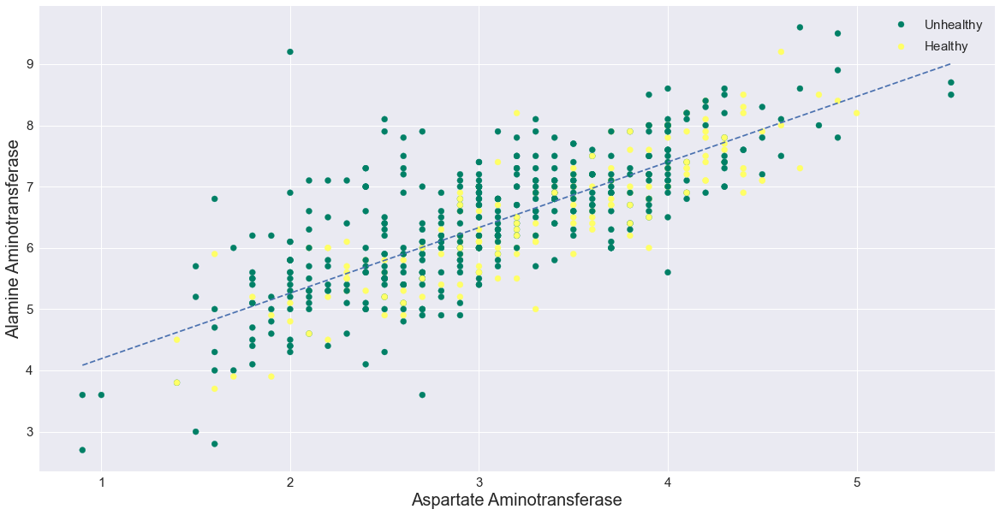

# machine-learning-model
Understand how a machine learning model works and it's technical terminology

---

### Purpose

*Machine Learning Track 4*

This repository is meant to be submitted to [Open Tech Summit 2021](https://www.opentechsummit.info/) for the final round! 

---

## Contents

Since the files are long, here is the topicwise list of every part of this project. But firstly you will be needing to [setup your system according to the environment](#system-setup)

#### Important Note
- If you are using HTML files to evaluate no need for any setup system, rather [directly refer to `contents.html` for easy navigation](contents.html)

- You may skip the analysis part as it contains analysis rather than the machine learning model and was not demanded, but was important for the latter part of the project.

    I will recommend to go through analysis not for evaluation but rather for knowledge and learning facts from the raw data without having any prior knowledge!

    I have added [a small summary at the end](#analysis-results), make sure you atleast go through that before getting into the project.

#### Index
1. [Analysis of the Dataset : analysis.ipynb](analysis.ipynb) (can be skipped - *Read note above*)
    - About the Dataset
    - Reading the data and rectify any incompleteness
    - Analysing factor & their dependence
        - Gender Distribution
        - Factors relation to liver disease
        - Similarities in Feature Distribution curves for 
        
            AG Ratio, Albumin, Direct Bilirubin, Total Proteins
    - Hypothesis based on analysis
    - Factual Check to prove our hypothesis
    - Corelation of factors with each other
        - Plotting and verification
        - Observations
    - Finishing Up Analysis

1. [ML Visualization : main_project.ipynb](main_project.ipynb)
    - Steps to train a machine
    - What exactly is training?
    - Building our own model through Analysis
    - Generating a model through ML
        - Comparision of accuracies

            Understanding how ML takes the edge!
    - Visualizing concepts of ML
        - Basics
        - Visualizing Bootstrapping with a dataset
        - Decision Tree
            - Gini Index
            - Understanding application of Gini Index
            - A peek to our model's of of decision tree
            - How bootstrapping affected size of dataset in a tree
        - Look at a full decision tree
            - Visualising it's complexity
                - Standard deviation and it's visual interpretation
                - STD as spread of data using Histogram
        - Visualizing `n_estimators` parameter in our model
            - Visual idea Aggregation using probability bar graph
            - Improvement in model by tweaking estimators
    - Summary

---

## System Setup

You can directly view and read Jupyter Notebook on github itself! No need to even clone the repository for using Github.

Otherwise to get started, firstly you will need to clone the repo to your local system's directory using git or [downloading and extracting project's zip](https://github.com/dvishal485/machine-learning-model/archive/refs/heads/main.zip)

```
git clone https://github.com/dvishal485/machine-learning-model
```

1. If you have `conda` environment manager installed on your system follow these instructions :
    - Open terminal and create a new environment and activate it

    ```
    conda env create -f environment.yml
    conda activate project
    ```
    - Now start jupyter-notebook server

    ```
    jupyter notebook
    ```
    - Open and evalute the files [as per the contents](#Contents)
1. If you have `python` installed in your system and not any environment manager, simply install the requirements

    ```
    pip install -r requirements.txt
    ```

    And afterwards start jupyter-notebook server

    ```
    jupyter notebook
    ```

1. If you have no idea about `conda` or `python`, no worries, just open the HTML Files namely :
    - [contents.html](contents.html)
    - [main_project.html](main_project.html)
    - [analysis.html](analysis.html)

---

## Analysis Results

By doing the analysis, I was able to deduce the following facts :

1. Liver Disease is closely related to levels of `Alkaline Phosphatase (ALP)` (`alkphos`) and `Aspartate Aminotransferase (AST)` (`sgot`)
    
    
1. Men are more likely to suffer from Liver Disease as compared to Women!
1. Along with these factors, a side-role is also played by the `Alanine Aminotransferase (ALT)` (`sgpt`), but it's contribution is relatively lower to the other factors, leading to hypothesis that `sgpt` is a factor which have to be considered along with the leading factors like `ALP` and `AST`
1. In general most of the factors are highly gender dependent. The levels of `Direct Bilirubin`, `Total Bilirubin` and `Albumin` & hence the `Albumin and Globulin Ratio` are higher in men.
1. From the histograms generated during the analysis, we might say that the distribution curve of these factors despite being gender dependent is similar for both genders. The shape of curve is indistinguishable, only the spread of the curve varies!
    - Note : y-axis reresents the frequency and since we have more data avaliable for men, the frequency is higher. But regardless of the frequency the two data can be compared through visualization!

    
1. Factors which are somehow corelated doesn't seem so random.

    
    
    Infact, they form a linear relation upto a certain point. And even beyond those points they can be visualized on a straight line!

    
